title: Transducers, powerful abstraction
author:
  name: I'm Adrien, frontend developer
  email: agibrat@frontguys.fr
theme: ./theme
controls: false
output: index.html

--

# Transducers

## powerful abstraction

--

## Transducers 𝍏

> <cite>[clojure.org](https://clojure.org/reference/transducers)</cite>
compose transformations <br>without awareness of input <br>nor creation of intermediate aggregates

<small class="fragment">* You may use it often without noticing it</small>

--

## Functional programing ♨

> <dfn title="">[Higher-order function](https://www.youtube.com/watch?v=BMUiFMZr7vk)</dfn><br>takes one or more functions as arguments or returns a function

```typescript
const add = a => (b => a + b); // returns a function

[1, 2, 3]
  .map(add(1))
  .filter(a => a % 2) // odd predicate (returns boolean)
;
[1, 2, 3]
  .reduce((acc, a) => acc + a, 0) // sum reducer (returns accumulator)
;
```

--

## Chain: readable but not optimal 😪

```typescript
import { add } from 'slides';

const double = item => item * 2;

const result = [1, 2, 3]
  .map(add(1))  // [2, 3, 4]
  .map(double)  // [4, 6, 8]
  .map(add(-1)) // [3, 5, 7]
;
```

<span class="fragment"><big style="color: red">❌</big> Loop 3&times;, allocating new array each time</span>

--

## Fusion 😃

```typescript
import { add, double } from 'slides';

const minus1 = add(-1);
const add1 = add(1);
const compute = item => minus1(double(add1(item)));

const result = [1, 2, 3]
  .map(compute)
;
```

<span class="fragment"><big style="color: green">✔</big> Loop once, allocating only one new array</span>

--

## Using composition 😁

```typescript
import { pipe, minus1, double, add1 } from 'slides';

// const compute = item => minus1(double(add1(item)));
// const compute = compose(minus1, double, add1);
const compute = pipe(add1, double, minus1);

const result = [1, 2, 3]
  .map(compute)
;
```

<span class="fragment"><big style="color: green">✔</big> Readable, concise & efficient</span>

--

## Mixed operations ? 😵

```typescript
import { add1, odd } from 'slides';

const gt2 = a => a > 2;

const result = [1, 2, 3]
  .map(add1)   // [2, 3, 4]
  .filter(gt2) // [3, 4]
  .filter(odd) // [3]
;
```

<span class="fragment"><big style="color: red">❌</big> Loop 3&times;, allocates 3 new array</span>

--

## Combine predicates 😆

```typescript
import { gt2, odd } from 'slides';

// logic: every = AND, some = OR
const pass = (logic, predicates) => 
  a => predicates[logic](predicate => predicate(a))
;

const filter = pass('every', [gt2, odd]);
```

<span class="fragment"><big style="color: green">✔</big> Useful with all predicate operations: filter, find...</span>

--
## Still no mixed operation 😵

```typescript
import { add1, odd, gt2 } from 'slides';

const result = [1, 2, 3]
  .map(add1)
  .filter(odd)
  .find(gt2)
;
```

<span class="fragment"><big style="color: red">❌</big> Loop 3&times;, allocates 3 new array </span>

--

## Be optimal 🤩



<div class="fragment" style="width: 66%"></div>

--

## Reduce all the things 😎

```typescript
import { append } from 'slides';

const map = mapper =>
  (list, value) => append(list, mapper(value))
;
const filter = predicate =>
  (list, value) => predicate(value) ? append(list, value) : list
;
const find = predicate =>
  (_, value) => predicate(value) ? { value, done: true } : null
;
```

<span class="fragment"><big style="color: red">💕</big> Implement every operation as a reducer</span>

--

## Make it composable 🤪

```typescript
let _map, _filter, _find; // _map(_filter(_find())) returns a reducer

const map = mapper =>
  _map = next => (acc, value) => next(acc, mapper(value))
;
const filter = predicate =>
  _filter = next => (acc, value) => predicate(value) ? next(acc, value) : acc
;
const find = predicate =>
  _find = () => (_, value) => predicate(value) ? { value, done: true } : null
;
```

<span class="fragment"><big style="color: green">🤟</big> Tansformation as factories of reducers are composable!</span>

--

## Compose reducers 😲

```typescript
import { pipe, map, add1, filter, odd, find, gt2, noop } from 'slides';

const transform = pipe(
  map(add1),
  filter(odd),
  find(gt2),
);

const result = [1, 2, 3].reduce(transform(noop));
```

<span class="fragment"><big style="color: green">✔</big> Rx pipe pattern ;) &nbsp; </span>
<span class="fragment">&nbsp; transform + reduce = transduce</span>
--

## Reduce to anything 🤠

```typescript
import { pipe, map, add1, filter, odd, append } from 'slides';

const transform = pipe(
  map(add1),
  filter(odd),
);

const result = [1, 2, 3].reduce(transform(append), []);
```

<span class="fragment"><big style="color: green">✔</big> Accumulator & 'append' function are linked (aggregate)</span>

--

## Reusable transduce 🤑

```typescript
import { reduce } from 'slides';

const transduce = (transform, aggregate, accumulator, list) =>
  reduce(transform(aggregate), accumulator, list)
;
```

<span class="fragment"><big style="color: green">✔</big> Fine, but how does this abstract input list type ?</span>

--

## A generic reduce 🤓

```typescript
const reduce = (reducer, accumulator, iterator) => {
  let step = iterator.next();
  while (!step.done) {
    accumulator = reducer(accumulator, step.value);
    if (accumulator.done) {
      return accumulator.value;
    }
    step = iterator.next();
  }
  return accumulator.value;
}
```

<span class="fragment"><big style="color: green">✔</big> Iterator allows to abstract how to reduce any iterable</span>

--

## It blow your mind 🤯

### Takeaway

**Transduce**
  - is **optimized** (iterate once, only needed items)
  - is **generic** (any types of sync / async collection)
  - powers **reactive & stream** based operations
  - I <span style="color: red">🖤</span> reduce

Curious? Look @ libs [RxJs](https://rxjs-dev.firebaseapp.com), [Ramda](https://ramdajs.com/docs), [lodash/fp](https://gist.github.com/jfmengels/6b973b69c491375117dc) & [more](https://github.com/stoeffel/awesome-fp-js)...

<br>

*P.S. Slides source [github.com/adriengibrat/Transduce-md](https://github.com/adriengibrat/Transduce-md)*
