title: Transducers, powerful abstraction
author:
  name: I'm Adrien, frontend developer
  email: a.gibrat@oodrive.com
theme: ./theme
controls: false
output: index.html

--

# Transducers

## powerful abstraction

--

## Transducers 𝍏

> <cite>[clojure.org](https://clojure.org/reference/transducers)</cite>
compose transformations <br>without awareness of input <br>nor creation of intermediate aggregates

<small>* You may use it often without noticing it</small>

--

## Functional programing ♨

```typescript
const add = a => b => a + b; // returns a function

[1, 2, 3]
  .map(add(1))
  .filter(a => !!(a % 2)) // odd predicate (returns boolean)
;
[1, 2, 3]
  .reduce((sum, a) => sum + a, 0) // sum reducer (returns accumulator)
;
```

> <dfn title="">[Higher-order function](https://www.youtube.com/watch?v=BMUiFMZr7vk)</dfn><br>takes one or more functions as arguments or returns a function

--

## Chain: readable but not optimal 😪

```typescript
import { add } from 'slides';

const double = item => item * 2;

const result = [1, 2, 3]
  .map(add(1)) // [2, 3, 4]
  .map(double) // [4, 6, 8]
  .map(add(-1)) // [3, 5, 7]
;
```

<big style="color: red">❌</big> Loop 3&times;, allocating new array each time

--

## Fusion 😃

```typescript
import { add, double } from 'slides';

const add1 = add(1);
const minus1 = add(-1);
const compute = item => minus1(double(add1(item)));

const result = [1, 2, 3]
  .map(compute)
;
```

<big style="color: green">✔</big> Loop once, allocating only one new array

--

## Using composition 😁

```typescript
import { pipe, add, double } from 'slides';

// const compute = compose(add(-1), double, add(1));
const compute = pipe(add(1), double, add(-1));

const result = [1, 2, 3]
  .map(compute)
;
```

<big style="color: green">✔</big> Semantic, concise & efficient

--

## Mixed operations ? 😵

```typescript
import { odd, add } from 'slides';

const result = [1, 2, 3]
  .map(add(1))
  .filter(odd)
  .slice(0, 1) // .filter(first(1))
;
// const first = n => () => n-- > 0;
```

<big style="color: red">❌</big> Loop 2&times;, allocates 3 new array

--

## Combine predicates 😆

```typescript
import { odd, first } from 'slides';

// every = AND, some = OR
const pass = (logic: 'every' | 'some', predicates: Function[]) => 
  a => predicates[logic](predicate => predicate(a))
;

const filter = pass('every', [odd, first(1)]);
```

<big style="color: green">✔</big> Useful with all predicate operations: filter, find, findIndex...

--
## Still no mixed operation 😵

```typescript
import { add, pass, odd, first } from 'slides';

const result = [1, 2, 3]
  .map(add(1))
  .filter(pass('every', [odd, first(1)]))
;
```

<big style="color: red">❌</big> Loop 2&times;, allocates 2 new array

--

## Be optimal 🤩



--

## Reduce all the things 😎

```typescript
const append = (list, value) => { list.push(value); return list; };

const map = mapper =>
  (list, value) => append(list, mapper(value))
;
const filter = predicate =>
  (list, value) => predicate(value) ? append(list, value) : list
;
const take = n => // =~ first
  (list, value) => list.length < n ? append(list, value) : list
;
```

<big style="color: blue">‼</big> Implement every operation with 'reduce'

--

## Make it composable 🤪

```typescript
import { append } from 'slides';

const map = mapper => append =>
  (list, value) => append(list, mapper(value))
;
const filter = predicate => append =>
  (list, value) => predicate(value) ? append(list, value) : list
;
const take = n => append =>
  (list, value) => list.length < n ? append(list, value) : list
;
```

<big style="color: blue">‼</big> Now we can compose reducers

--

## Compose reducers 😲

```typescript
import { pipe, filter, take, map, add, odd } from 'slides';

const transform = pipe(
  map(add(1)),
  filter(odd),
  take(1),
);

const result = [1, 2, 3].reduce(transform(append), []);
```

<big style="color: green">✔</big> rx pipe pattern ;)

--

## Reusable transduce 🤑

```typescript
import { reduce } from 'slides';

const transduce = (transform, append, accumulator, list) =>
  reduce(transform(append), accumulator, list)
// list.reduce(transform(append), accumulator)
;
```

<big style="color: green">✔</big> Fine, but how does this abstract list type ?

--

## A generic reduce 🤓

```typescript
const _reduce = (reducer, accumulator, iterator) => {
  let step;
  do {
    step = iterator.next();
    accumulator = reducer(accumulator, step.value);
  } while (!step.done);
  return accumulator;
}
```

<big style="color: green">✔</big> Iterator allows to abstract how to reduce any iterable

--

## Stop iteration 🤠

```typescript
const reduce = (reducer, accumulator, iterator) => {
  let step;
  do {
    step = iterator.next();
    accumulator = reducer(accumulator, step.value);
    if (accumulator.reduced) {
      return accumulator.value;
    }
  } while (!step.done)
  return accumulator.value;
}
```

<big style="color: green">✔</big> Avoid to iterate whole collection when not needed

--

## Dit it blow your mind ? 🤯

### Takeaway

**Transduce**
  - is **optimized** (iterate once, only needed items)
  - is **generic** (any types of sync / async collection)
  - powers **reactive & stream** based operations
  - I <span style="color: red">🖤</span> reduce

Curious? Look @ libs [Ramda](https://ramdajs.com/docs), [lodash/fp](https://gist.github.com/jfmengels/6b973b69c491375117dc) & [more](https://github.com/stoeffel/awesome-fp-js)...

<br>

*P.S. FP offers lot more [powerfull abstractions](https://www.youtube.com/watch?v=9QveBbn7t_c).*
